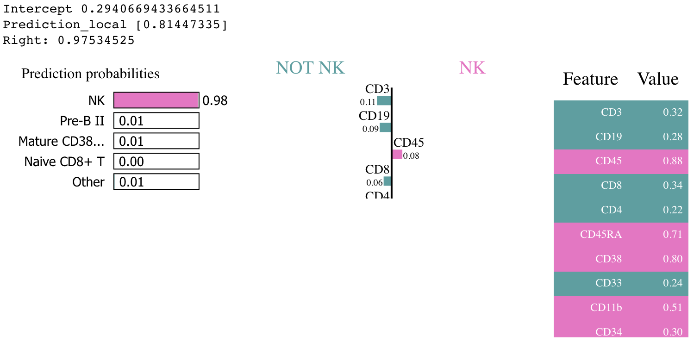

# Opening The Black Box — Interpretability In Deep Learning

## Why interpretability?

In the last decade, the application of deep neural networks to long-standing problems has brought a break-through in performance and prediction power.
However, high accuracy, deriving from the increased model complexity, often comes at the price of loss of interpretability, i.e., many of these models behave as black-boxes and fail to provide explanations on their predictions.
While in certain application fields this issue may play a secondary role, in high risk domains, e.g., health care, it is crucial to build trust in a model and being able to understand its behaviuor.

## What is interpretability?

The definition of the verb *interpret* is "to explain or tell the meaning of : present in understandable terms" ([Merriam-Webster 2019](https://www.merriam-webster.com/dictionary/interpret)).
Despite the apparent simplicity of this statement, the machine learning research community is struggling to agree upon a formal definition of the concept of interpretability/explainability.
In the last years, in the room left by this lack of formalism, many methodologies have been proposed based on different "interpretations" (pun intended) of the above defintion.
While the proliferation of this multitude of disparate algorithms has posed challenges on rigorously comparing them, it is nevertheless interesting and useful to apply these techniques to analyze the behaviour of deep learning models.

## What is this tutorial about?

This tutorial focuses on illustrating some of the recent advancements in the field of interpretable deep learning.
We will show common techniques that can be used to explain predictions on pretrained models and that can be used to shed light on their inner mechanisms.
The tutorial is aimed to strike the right balance between theoretical input and practical exercises.
The session has been designed to provide the participants not only with the theory behind deep learning interpretability, but also to offer a set of frameworks and tools that they can easily reuse in their own projects.

### depiction: a framework for explanability

The group of Cognitive Health Care and Life Sciences at IBM Research Zürich has opensourced a python toolbox, [depiction](https://github.com/IBM/dl-interpretability-compbio), with the aim of providing a framework to ease the application of explainability methods on custom models, especially for less experienced users.
The module provide wrappers for multiple algorithms and is continously updated including the latest algorithms from [AIX360](https://github.com/IBM/AIX360.git).
The core concept behind depiction is to allow users to seamlessly run state-of-art interpretability methods with minimal requirements in terms of programming skills.
Below an example of how depiction can be used to analyze a pretrained model.

### A simple example

Let's assume to have a fancy model for classification of tabular data pretrained in Keras and avaialble at a public url.
Explaining its predictions with `depiction` is easy as implementing a lightweight wrapper of `depiction.models.uri.HTTPModel` where its `predict` method is overloaded.

```python
from depiction.core import Task, DataType
from depiction.models.uri import HTTPModel


class FancyModel(HTTPModel):
    """A fancy classifier."""


    def __init__(self,
        filename='fancy_model.h5',
        origin='https://url/to/my/fancy_model.h5',
        cache_dir='/path/to/cache/models',
        *args, **kwargs):
        """Initialize the FancyModel."""
        super().__init__(
            uri=origin,
            task=Task.CLASSIFICATION,
            data_type=DataType.TABULAR,
            cache_dir=cache_dir,
            filename=filename
        )
        self.model = keras.models.load_model(self.model_path)

    def predict(self, sample, *args, **kwargs):
        """
        Run the fancy model for inference on a given sample and with the provided
        parameters.

        Args:
            sample (object): an input sample for the model.
            args (list): list of arguments.
            kwargs (dict): list of key-value arguments.

        Returns:
            a prediction for the model on the given sample.
        """
        return self.model.predict(
            sample,
            batch_size=None, verbose=0,
            steps=None, callbacks=None
        )
```

Once `FancyModel` is implemented, using any of the `depiction.interpreters` available in the library, is as easy as typing:

```python
fancy_model = FancyModel()
# NOTE: interpreters are implemented inheriting from
# depiction.interpreters.base.base_interpreter.BaseInterpreter
# and they share a common interface.
explanations = interpreter.interpret(example)
```

The explanations generated depend on the specific interpreter used.
For example, in the case of exaplanations generated using [LIME](https://github.com/marcotcr/lime) ([Ribeiro et al.](https://arxiv.org/abs/1602.04938)), when using a Jupyter notebook, one can simply run:

```python
# LIME example
from depiction.interpreters.u_wash import UWasher

# NOTE: `interpreter_params`: minimal settings for the dataset considered
# NOTE: `explanation_configs`: minimal settings for the dataset considered

interpreter = UWasher('lime', fancy_model, **interpreter_params)
interpreter.interpret(example, explanation_configs=explanation_configs)
```

and directly obtain the model-specific explanation:

<p align="center">
  
</p>

## Want to know more?

If you found this blog post interesting and you want  to know more about interpretability and depiction, come and join us at the tutorial ["Opening The Black Box — Interpretability In Deep Learning"](https://odsc.com/training/portfolio/opening-the-black-box-interpretability-in-deep-learning/) at [ODSC2019](https://odsc.com/london/) next November 20th in London.
